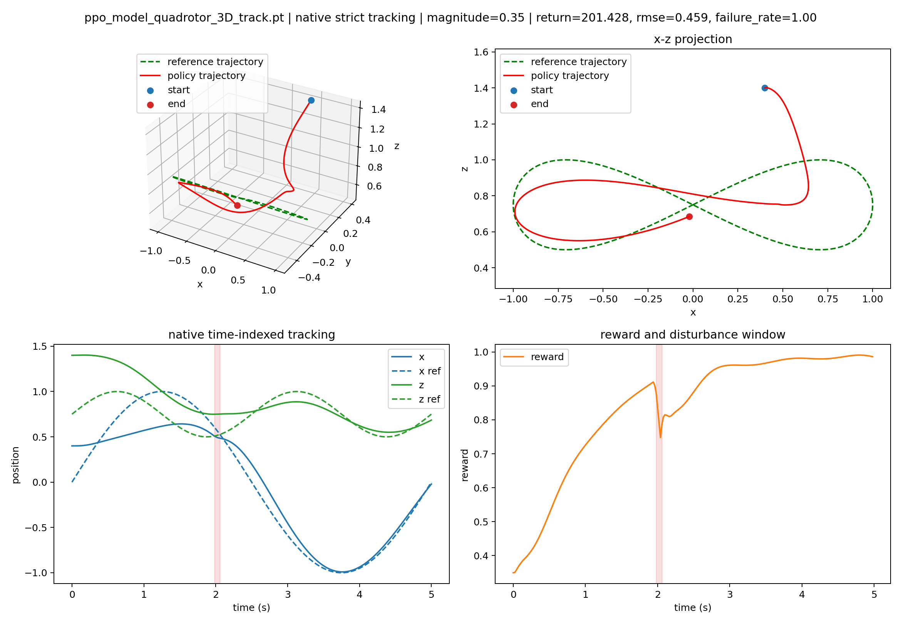
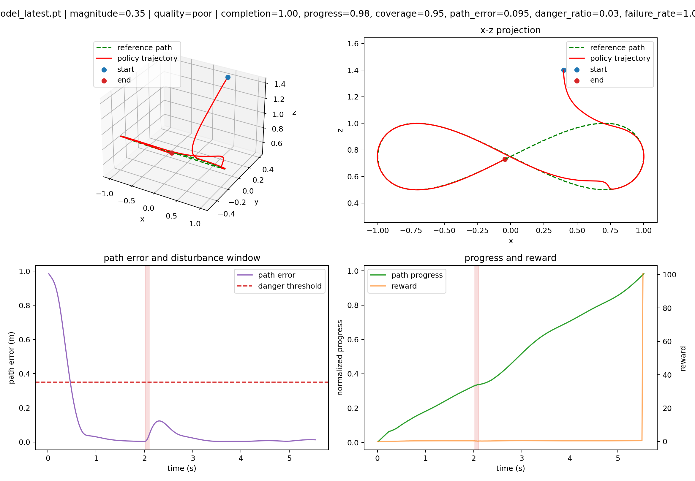
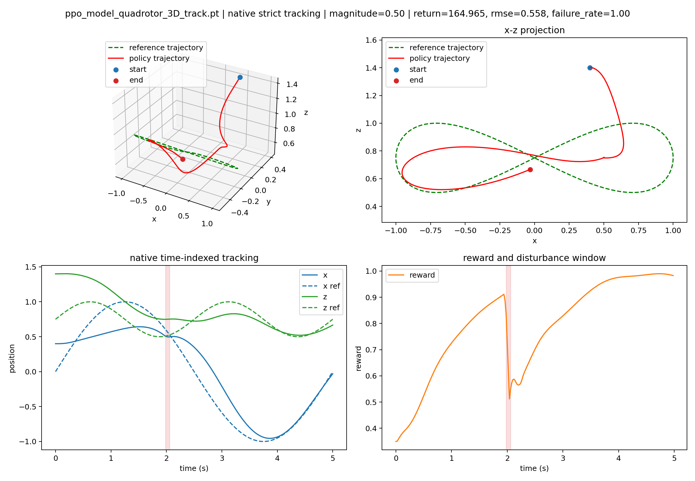
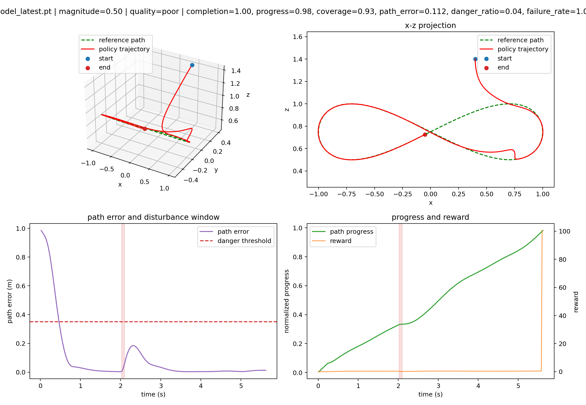
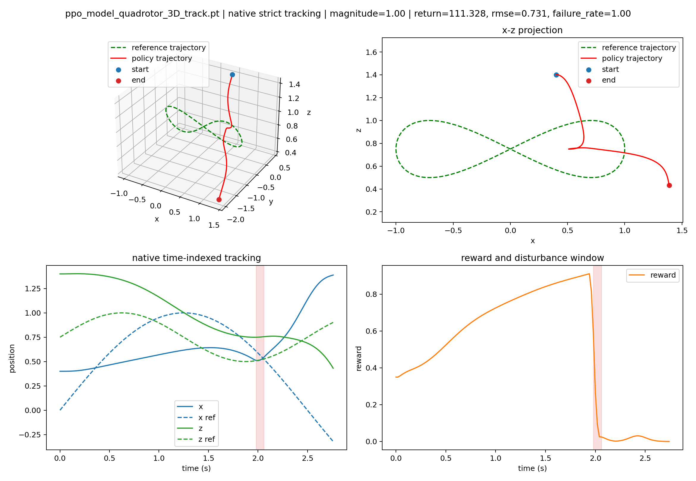
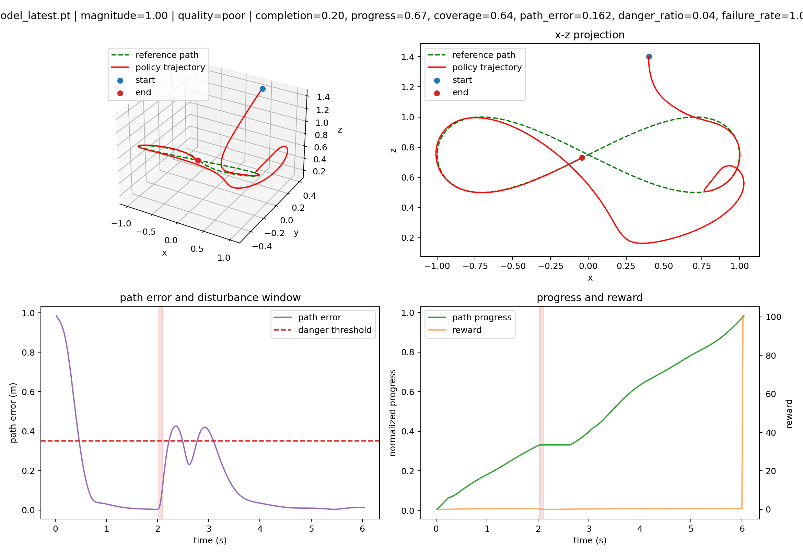

# Disturbance-aware Robust Quadrotor Path Following

This repository contains a research extension built on top of [`safe-control-gym`](https://github.com/learnsyslab/safe-control-gym). The main codebase lives in [`safe-control-gym-main/`](safe-control-gym-main/). The original safe-control-gym README is preserved at [`safe-control-gym-main/README.md`](safe-control-gym-main/README.md).

## Project Summary

This project studies robust path following and recovery control for a quadrotor under sudden disturbances. The goal is to train a single reinforcement learning policy that can complete nominal figure-eight flight, recover after an impulse disturbance, rejoin the path, and continue the task.

The project is based on the `quadrotor_3D figure8 trajectory tracking` environment in safe-control-gym. The original task is strict time-indexed trajectory tracking, where PPO tracks `X_GOAL[next_step]`. Instead of tuning the PPO algorithm itself, this project reformulates the original tracking task as a disturbance-aware robust path-following / path-completion task.

## Motivation

The original safe-control-gym objective rewards the policy for staying close to the time-indexed reference point at each control step. This formulation is reasonable for nominal tracking, but it is not ideal for post-disturbance recovery. After the drone is pushed away from the reference trajectory, a reasonable behavior may be to stabilize first and then rejoin the path. However, the strict time-indexed reward still penalizes the policy for missing the current reference point.

This project therefore asks whether task reformulation, reward redesign, and curriculum training can help an RL policy learn post-disturbance recovery and continuation, rather than only optimizing nominal tracking error.

## Method

The project keeps the safe-control-gym quadrotor dynamics and PPO training pipeline, but changes the task definition at the environment level.

First, the reference selection is changed from `X_GOAL[next_step]` to a path-following reference. The current state is projected onto the geometric figure-eight path, and a forward lookahead reference is selected.

Second, the reward is redesigned to include path error, path progress, danger-zone penalties, a completion bonus, and progress gating. This prevents the policy from obtaining progress reward while being far away from the path.

Finally, training uses both disturbance curriculum and multi-start curriculum. Impulse disturbance magnitudes are gradually introduced, and the initial-state distribution is widened from near-start to medium-start and wide-start settings. This encourages the policy to merge onto the figure-eight path from different initial states and complete the path after disturbances.

## Experiments

Experiments are conducted in the safe-control-gym / PyBullet simulator. Disturbances are implemented as short-duration dynamics impulse disturbances: a random-direction external disturbance vector is applied to the quadrotor through the simulator.

The reported values `magnitude=0.35`, `magnitude=0.5`, and `magnitude=1.0` are simulator disturbance magnitude parameters, not calibrated real-world Newton values.

The comparison includes:

- the original pretrained strict-tracking PPO, evaluated in its native strict time-indexed tracking environment;
- the multi-start robust path-following PPO trained in this project, evaluated in the robust path-following completion environment.

Both policies are evaluated from the original project's nominal start state:

```text
x = 0.4
y = 0.4
z = 1.4
```

## Results

From the original project's nominal start, the original PPO shows degraded tracking performance as the disturbance magnitude increases:

| Method | Disturbance magnitude | Main metrics |
| --- | ---: | --- |
| Original strict-tracking PPO | 0.35 | return=201.428, RMSE=0.459 |
| Original strict-tracking PPO | 0.50 | return=164.965, RMSE=0.558 |
| Original strict-tracking PPO | 1.00 | return=111.328, RMSE=0.731 |

In contrast, the multi-start robust PPO maintains strong path-completion behavior at `magnitude=0.35` and `magnitude=0.5`:

| Method | Disturbance magnitude | Main metrics |
| --- | ---: | --- |
| Multi-start robust path-following PPO | 0.35 | progress=0.984, coverage=0.955, path_error=0.095, completion=1.00 |
| Multi-start robust path-following PPO | 0.50 | progress=0.983, coverage=0.926, path_error=0.112, completion=1.00 |
| Multi-start robust path-following PPO | 1.00 | progress=0.674, coverage=0.644, path_error=0.162, completion=0.20 |

These results suggest that the multi-start robust PPO can merge onto the figure-eight path and continue the task under moderate disturbances. At `magnitude=1.0`, however, the completion rate drops substantially, indicating a clear robustness boundary.

## Experiment Figures

All visualizations below use the original project's nominal start state, `x=0.4, y=0.4, z=1.4`. The left figure shows the original strict-tracking PPO in its native time-indexed tracking environment. The right figure shows the multi-start robust path-following PPO in the path-completion environment.

### Moderate Disturbance: `magnitude=0.35`

<p float="left">
  
  
</p>

At `magnitude=0.35`, the original PPO still follows the strict time-indexed tracking objective, but its tracking error increases after the disturbance. The multi-start robust PPO maintains high path progress and coverage and continues completing the figure-eight path.

### Medium-high Disturbance: `magnitude=0.50`

<p float="left">
  
  
</p>

At `magnitude=0.50`, the original PPO further degrades in return and RMSE. The proposed model still achieves `progress=0.983`, `coverage=0.926`, and `completion=1.00`, showing that the multi-start and disturbance curriculum are effective in the moderate disturbance range.

### Robustness Boundary: `magnitude=1.00`

<p float="left">
  
  
</p>

At `magnitude=1.00`, the proposed policy's completion rate drops to `0.20`. This shows that the policy is not universally robust; instead, it reaches a clear capability boundary under stronger disturbances. This also motivates future work on broader disturbance curricula, stronger recovery objectives, or improved policy architectures.

## Significance

The main contribution of this project is to reinterpret a standard quadrotor trajectory tracking benchmark as a recovery-aware robust path-following problem. The goal is not to claim that PPO itself is inherently better than the original PPO baseline. Rather, the results suggest that the original strict time-indexed tracking formulation is not well suited for post-disturbance recovery and continuation.

By using path-following references, reward redesign, disturbance curriculum, and multi-start curriculum, the policy can rejoin the figure-eight path from different initial states and continue the task after moderate disturbances. Although the current results are simulation-based, they support a clear research direction: in safety-critical quadrotor control, task definition and training distribution strongly shape the recovery behavior learned by RL policies.

## Main Files

Robust path-following / multi-start task configs:

- [`quadrotor_3D_robust_figure8_completion.yaml`](safe-control-gym-main/examples/rl/config_overrides/quadrotor_3D/quadrotor_3D_robust_figure8_completion.yaml)
- [`quadrotor_3D_robust_figure8_multistart_near.yaml`](safe-control-gym-main/examples/rl/config_overrides/quadrotor_3D/quadrotor_3D_robust_figure8_multistart_near.yaml)
- [`quadrotor_3D_robust_figure8_multistart_medium.yaml`](safe-control-gym-main/examples/rl/config_overrides/quadrotor_3D/quadrotor_3D_robust_figure8_multistart_medium.yaml)
- [`quadrotor_3D_robust_figure8_multistart_wide.yaml`](safe-control-gym-main/examples/rl/config_overrides/quadrotor_3D/quadrotor_3D_robust_figure8_multistart_wide.yaml)

Original-start strict-tracking baseline config:

- [`quadrotor_3D_track_original_start_only.yaml`](safe-control-gym-main/examples/rl/config_overrides/quadrotor_3D/quadrotor_3D_track_original_start_only.yaml)

Training and evaluation scripts:

- [`train_robust_path_follow_ppo.sh`](safe-control-gym-main/examples/rl/train_robust_path_follow_ppo.sh)
- [`evaluate_robust_path_follow_ppo.py`](safe-control-gym-main/examples/rl/evaluate_robust_path_follow_ppo.py)
- [`compare_original_vs_robust_ppo.py`](safe-control-gym-main/examples/rl/compare_original_vs_robust_ppo.py)

Representative evaluation outputs:

- [`original_project_start_original_vs_multistart_wide_seed10`](safe-control-gym-main/examples/rl/results/original_project_start_original_vs_multistart_wide_seed10/)
- [`original_project_start_high_impulse_original_vs_multistart_wide_seed10`](safe-control-gym-main/examples/rl/results/original_project_start_high_impulse_original_vs_multistart_wide_seed10/)

## Quick Start

Install the modified safe-control-gym project:

```bash
cd safe-control-gym-main
python -m pip install -e .
```

Run robust PPO evaluation:

```bash
cd safe-control-gym-main/examples/rl

MPLCONFIGDIR=/tmp/mplconfig KMP_DUPLICATE_LIB_OK=TRUE /opt/anaconda3/envs/Drone/bin/python evaluate_robust_path_follow_ppo.py \
  --run_dir ./results/ppo_quadrotor_3D_figure8_multistart_wide_seed2 \
  --model latest \
  --magnitudes 0.35 0.5 1.0 \
  --n_episodes 10 \
  --seed 10 \
  --save_plot
```

Run the original-vs-robust comparison:

```bash
cd safe-control-gym-main/examples/rl

MPLCONFIGDIR=/tmp/mplconfig KMP_DUPLICATE_LIB_OK=TRUE /opt/anaconda3/envs/Drone/bin/python compare_original_vs_robust_ppo.py \
  --output-dir ./results/original_project_start_original_vs_multistart_wide_seed10 \
  --native-task-config ./config_overrides/quadrotor_3D/quadrotor_3D_track_original_start_only.yaml \
  --robust-run-dir ./results/ppo_quadrotor_3D_figure8_multistart_wide_seed2 \
  --robust-checkpoint model_latest.pt \
  --magnitudes 0.35 0.5 1.0 \
  --n-episodes 10 \
  --seed 10 \
  --save-plot
```
