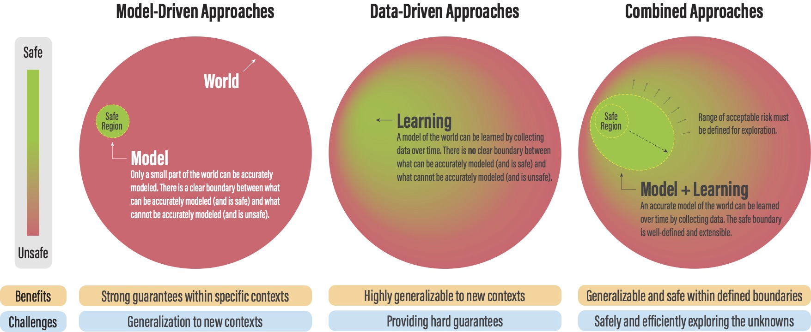
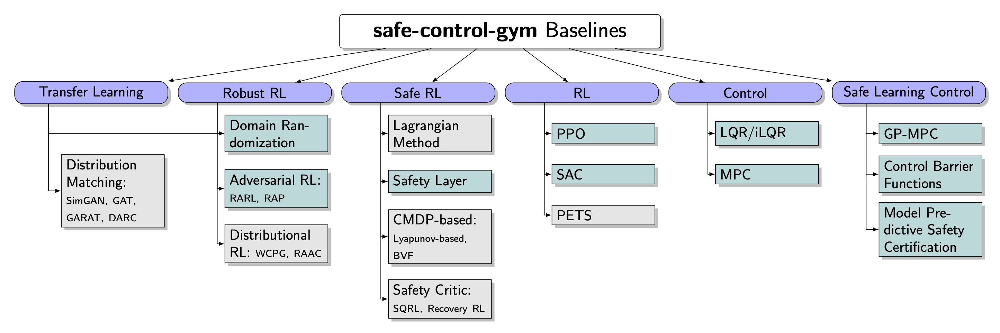
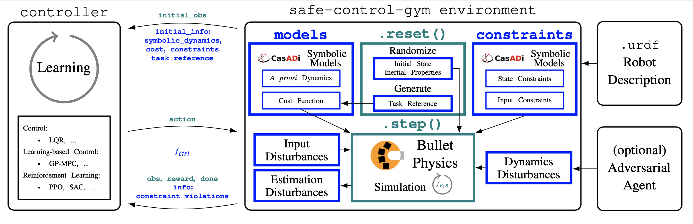
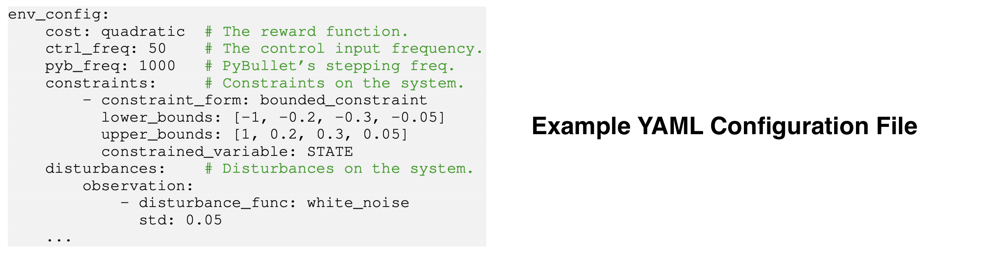
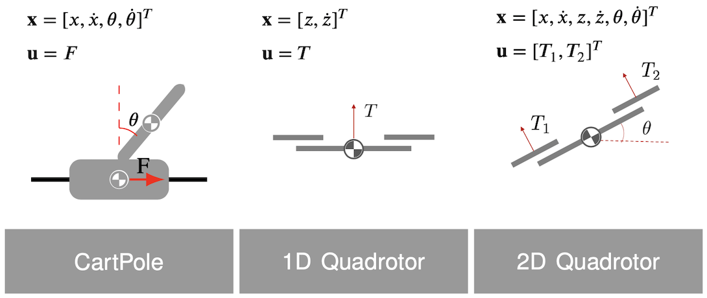
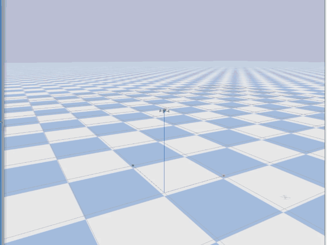
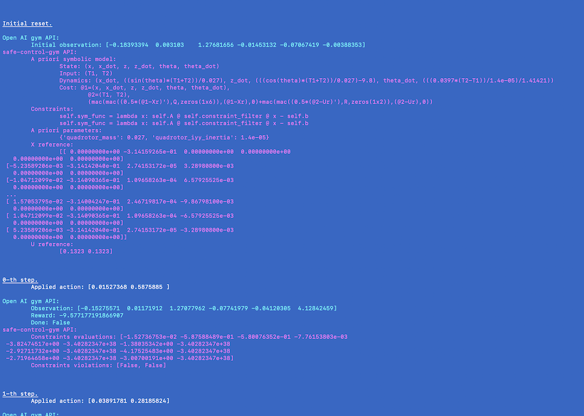

# safe-control-gym

Physics-based CartPole and Quadrotor [Gym](https://gym.openai.com) environments (using [PyBullet](https://pybullet.org/wordpress/)) with symbolic *a priori* dynamics (using [CasADi](https://web.casadi.org)) for **learning-based control**, and model-free and model-based **reinforcement learning** (RL).

These environments include (and evaluate) symbolic safety constraints and implement input, parameter, and dynamics disturbances to test the robustness and generalizability of control approaches. [[PDF]](https://arxiv.org/pdf/2108.06266.pdf)



```bibtex
@article{brunke2021safe,
         title={Safe Learning in Robotics: From Learning-Based Control to Safe Reinforcement Learning},
         author={Lukas Brunke and Melissa Greeff and Adam W. Hall and Zhaocong Yuan and Siqi Zhou and Jacopo Panerati and Angela P. Schoellig},
         journal = {Annual Review of Control, Robotics, and Autonomous Systems},
         year={2021},
         url = {https://arxiv.org/abs/2108.06266}}
```

To reproduce the results in the article, see [branch `ar`](https://github.com/learnsyslab/safe-control-gym/releases/tag/v0.5.0).

```bibtex
@article{yuan2021safecontrolgym,
  author={Yuan, Zhaocong and Hall, Adam W. and Zhou, Siqi and Brunke, Lukas and Greeff, Melissa and Panerati, Jacopo and Schoellig, Angela P.},
  journal={IEEE Robotics and Automation Letters},
  title={Safe-Control-Gym: A Unified Benchmark Suite for Safe Learning-Based Control and Reinforcement Learning in Robotics},
  year={2022},
  volume={7},
  number={4},
  pages={11142-11149},
  doi={10.1109/LRA.2022.3196132}}
```

To reproduce the results in the article, see [branch `submission`](https://github.com/learnsyslab/safe-control-gym/releases/tag/v0.6.0).

<!--  -->

## Project Extension: Disturbance-aware Robust Quadrotor Path Following

### Project Summary

This project studies robust path following and recovery control for a quadrotor under sudden disturbances. The goal is to train a single reinforcement learning policy that can complete nominal figure-eight flight, recover after an impulse disturbance, rejoin the path, and continue the task. The project is based on the `quadrotor_3D figure8 trajectory tracking` environment in safe-control-gym. The original task is strict time-indexed trajectory tracking, where PPO tracks `X_GOAL[next_step]`. Instead of tuning the PPO algorithm itself, this project reformulates the original tracking task as a disturbance-aware robust path-following / path-completion task.

### Motivation

The original safe-control-gym objective rewards the policy for staying close to the time-indexed reference point at each control step. This formulation is reasonable for nominal tracking, but it is not ideal for post-disturbance recovery. After the drone is pushed away from the reference trajectory, a reasonable behavior may be to stabilize first and then rejoin the path. However, the strict time-indexed reward still penalizes the policy for missing the current reference point. This project therefore asks: can task reformulation, reward redesign, and curriculum training help an RL policy learn post-disturbance recovery and continuation, rather than only optimizing nominal tracking error?

### Method

The project keeps the safe-control-gym quadrotor dynamics and PPO training pipeline, but changes the task definition at the environment level. First, the reference selection is changed from `X_GOAL[next_step]` to a path-following reference: the current state is projected onto the geometric figure-eight path, and a forward lookahead reference is selected. Second, the reward is redesigned to include path error, path progress, danger-zone penalties, a completion bonus, and progress gating, so that the policy cannot obtain progress reward while being far away from the path. Finally, the training uses both disturbance curriculum and multi-start curriculum: impulse disturbance magnitudes are gradually introduced, and the initial-state distribution is widened from near-start to medium-start and wide-start settings. This encourages the policy to merge onto the figure-eight path from different initial states and complete the path after disturbances.

### Experiments

Experiments are conducted in the safe-control-gym / PyBullet simulator. Disturbances are implemented as short-duration dynamics impulse disturbances: a random-direction external disturbance vector is applied to the quadrotor through the simulator. The reported values `magnitude=0.35, 0.5, 1.0` are simulator disturbance magnitude parameters, not calibrated real-world Newton values. The comparison includes the original pretrained strict-tracking PPO and the multi-start robust path-following PPO trained in this project. Both policies are evaluated from the original project's nominal start state, `x=0.4, y=0.4, z=1.4`, under the same disturbance magnitudes. The original PPO is evaluated in its native strict-tracking environment, while the proposed policy is evaluated in the robust path-following completion environment.

### Results

From the original project's nominal start, the original PPO shows degraded tracking performance as the disturbance magnitude increases:

| Method | Disturbance magnitude | Main metrics |
| --- | ---: | --- |
| Original strict-tracking PPO | 0.35 | return=201.428, RMSE=0.459 |
| Original strict-tracking PPO | 0.50 | return=164.965, RMSE=0.558 |
| Original strict-tracking PPO | 1.00 | return=111.328, RMSE=0.731 |

In contrast, the multi-start robust PPO maintains strong path-completion behavior at `magnitude=0.35` and `magnitude=0.5`:

| Method | Disturbance magnitude | Main metrics |
| --- | ---: | --- |
| Multi-start robust path-following PPO | 0.35 | progress=0.984, coverage=0.955, path_error=0.095, completion=1.00 |
| Multi-start robust path-following PPO | 0.50 | progress=0.983, coverage=0.926, path_error=0.112, completion=1.00 |
| Multi-start robust path-following PPO | 1.00 | progress=0.674, coverage=0.644, path_error=0.162, completion=0.20 |

These results suggest that the multi-start robust PPO can merge onto the figure-eight path and continue the task under moderate disturbances. At `magnitude=1.0`, however, the completion rate drops substantially, indicating a clear robustness boundary.

### Experiment Figures

All visualizations below use the original project's nominal start state, `x=0.4, y=0.4, z=1.4`. The left figure shows the original strict-tracking PPO in its native time-indexed tracking environment. The right figure shows the multi-start robust path-following PPO in the path-completion environment.

#### Moderate Disturbance: `magnitude=0.35`

<p float="left">
  
  
</p>

At `magnitude=0.35`, the original PPO still follows the strict time-indexed tracking objective, but its tracking error increases after the disturbance. The multi-start robust PPO maintains high path progress and coverage and continues completing the figure-eight path.

#### Medium-high Disturbance: `magnitude=0.50`

<p float="left">
  
  
</p>

At `magnitude=0.50`, the original PPO further degrades in return and RMSE. The proposed model still achieves `progress=0.983`, `coverage=0.926`, and `completion=1.00`, showing that the multi-start and disturbance curriculum are effective in the moderate disturbance range.

#### Robustness Boundary: `magnitude=1.00`

<p float="left">
  
  
</p>

At `magnitude=1.00`, the proposed policy's completion rate drops to `0.20`. This shows that the policy is not universally robust; instead, it reaches a clear capability boundary under stronger disturbances. This also motivates future work on broader disturbance curricula, stronger recovery objectives, or improved policy architectures.

### Significance

The main contribution of this project is to reinterpret a standard quadrotor trajectory tracking benchmark as a recovery-aware robust path-following problem. The goal is not to claim that PPO itself is inherently better than the original PPO baseline. Rather, the results suggest that the original strict time-indexed tracking formulation is not well suited for post-disturbance recovery and continuation. By using path-following references, reward redesign, disturbance curriculum, and multi-start curriculum, the policy can rejoin the figure-eight path from different initial states and continue the task after moderate disturbances. Although the current results are simulation-based, they support a clear research direction: in safety-critical quadrotor control, task definition and training distribution strongly shape the recovery behavior learned by RL policies.

### Main Files

- Robust path-following / multi-start task configs:
  - `examples/rl/config_overrides/quadrotor_3D/quadrotor_3D_robust_figure8_completion.yaml`
  - `examples/rl/config_overrides/quadrotor_3D/quadrotor_3D_robust_figure8_multistart_near.yaml`
  - `examples/rl/config_overrides/quadrotor_3D/quadrotor_3D_robust_figure8_multistart_medium.yaml`
  - `examples/rl/config_overrides/quadrotor_3D/quadrotor_3D_robust_figure8_multistart_wide.yaml`
- Original-start strict-tracking baseline config:
  - `examples/rl/config_overrides/quadrotor_3D/quadrotor_3D_track_original_start_only.yaml`
- Training and evaluation scripts:
  - `examples/rl/train_robust_path_follow_ppo.sh`
  - `examples/rl/evaluate_robust_path_follow_ppo.py`
  - `examples/rl/compare_original_vs_robust_ppo.py`
- Representative evaluation outputs:
  - `examples/rl/results/original_project_start_original_vs_multistart_wide_seed10/`
  - `examples/rl/results/original_project_start_high_impulse_original_vs_multistart_wide_seed10/`

## Install on Ubuntu/macOS

### Clone repo

```bash
git clone https://github.com/learnsyslab/safe-control-gym.git
cd safe-control-gym
```

### (optional) Create a `conda` environment

Create and access a Python 3.10 environment using
[`conda`](https://docs.conda.io/projects/conda/en/latest/user-guide/install/index.html)

```bash
conda create -n safe python=3.10
conda activate safe
```

### Install

Install the `safe-control-gym` repository

```bash
python -m pip install --upgrade pip
python -m pip install -e .
```

#### Note

You may need to separately install `gmp`, a dependency of `pycddlib`:

 ```bash
conda install -c anaconda gmp
 ```

or

  ```bash
 sudo apt-get install libgmp-dev
 ```

 #### (optional) Additional requirements for MPC

You may need to separately install [`acados`](https://github.com/acados/acados) for fast MPC implementations.

- To build and install acados, see their [installation guide](https://docs.acados.org/installation/index.html).
- To set up the acados python interface, check out [these installation steps](https://docs.acados.org/python_interface/index.html).

## Architecture

Overview of [`safe-control-gym`](https://arxiv.org/abs/2109.06325)'s API:



## Configuration



## Getting Started

Familiarize with APIs and environments with the scripts in [`examples/`](https://github.com/learnsyslab/safe-control-gym/tree/main/examples)

### 3D Quadrotor Lemniscate Trajectory Tracking with PID

```bash
cd ./examples/   # Navigate to the examples folder
python3 pid/pid_experiment.py \
    --algo pid \
    --task quadrotor \
    --overrides \
        ./pid/config_overrides/quadrotor_3D/quadrotor_3D_track.yaml
```

 

### Cartpole Stabilization with LQR

```bash
cd ./examples/   # Navigate to the examples folder
python3 lqr/lqr_experiment.py \
    --algo lqr \
    --task cartpole \
    --overrides \
        ./lqr/config_overrides/cartpole/cartpole_stab.yaml \
        ./lqr/config_overrides/cartpole/lqr_cartpole_stab.yaml
```

### 2D Quadrotor Trajectory Tracking with PPO

```bash
cd ./examples/rl/   # Navigate to the RL examples folder
python3 rl_experiment.py \
    --algo ppo \
    --task quadrotor \
    --overrides \
        ./config_overrides/quadrotor_2D/quadrotor_2D_track.yaml \
        ./config_overrides/quadrotor_2D/ppo_quadrotor_2D.yaml \
    --kv_overrides \
        algo_config.training=False
```

### Verbose API Example

```bash
cd ./examples/   # Navigate to the examples folder
python3 no_controller/verbose_api.py \
    --task cartpole \
    --overrides no_controller/verbose_api.yaml
```



## List of Implemented Controllers

- [PID](https://github.com/learnsyslab/safe-control-gym/blob/main/safe_control_gym/controllers/pid/pid.py)
- [LQR](https://github.com/learnsyslab/safe-control-gym/blob/main/safe_control_gym/controllers/lqr/lqr.py)
- [iLQR](https://github.com/learnsyslab/safe-control-gym/blob/main/safe_control_gym/controllers/lqr/ilqr.py)
- [Linear MPC](https://github.com/learnsyslab/safe-control-gym/blob/main/safe_control_gym/controllers/mpc/linear_mpc.py)
- [GP-MPC](https://github.com/learnsyslab/safe-control-gym/blob/main/safe_control_gym/controllers/mpc/gp_mpc.py)
- [SAC](https://github.com/learnsyslab/safe-control-gym/blob/main/safe_control_gym/controllers/sac/sac.py)
- [PPO](https://github.com/learnsyslab/safe-control-gym/blob/main/safe_control_gym/controllers/ppo/ppo.py)
- [DDPG](https://github.com/learnsyslab/safe-control-gym/blob/main/safe_control_gym/controllers/ddpg/ddpg.py)
- [Safety Layer](https://github.com/learnsyslab/safe-control-gym/tree/main/safe_control_gym/controllers/safe_explorer)
- [RARL](https://github.com/learnsyslab/safe-control-gym/blob/main/safe_control_gym/controllers/rarl/rarl.py)
- [RAP](https://github.com/learnsyslab/safe-control-gym/blob/main/safe_control_gym/controllers/rarl/rap.py)

## List of Implemented Safety Filters

- [MPSC](https://github.com/learnsyslab/safe-control-gym/blob/main/safe_control_gym/safety_filters/mpsc/linear_mpsc.py)
- [CBF](https://github.com/learnsyslab/safe-control-gym/blob/main/safe_control_gym/safety_filters/cbf/cbf.py)
- [Neural Network CBF](https://github.com/learnsyslab/safe-control-gym/blob/main/safe_control_gym/safety_filters/cbf/cbf_nn.py)

## Performance

We compare the sample efficiency of `safe-control-gym` with the original [OpenAI Cartpole][001] and [PyBullet Gym's Inverted Pendulum][002], as well as [`gym-pybullet-drones`][003].
We choose the default physic simulation integration step of each project.
We report performance results for open-loop, random action inputs.
Note that the Bullet engine frequency reported for `safe-control-gym` is typically much finer grained for improved fidelity.
`safe-control-gym` quadrotor environment is not as light-weight as [`gym-pybullet-drones`][003] but provides the same order of magnitude speed-up and several more safety features/symbolic models.

| Environment                | GUI    | Control Freq.  | PyBullet Freq.  | Constraints & Disturbances^       | Speed-Up^^      |
| :------------------------: | :----: | :------------: | :-------------: | :-------------------------------: | :-------------: |
| [Gym cartpole][001]        | True   | 50Hz           | N/A             | No                                | 1.16x           |
| [InvPenPyBulletEnv][002]   | False  | 60Hz           | 60Hz            | No                                | 158.29x         |
| [cartpole][004]            | True   | 50Hz           | 50Hz            | No                                | 0.85x           |
| [cartpole][004]            | False  | 50Hz           | 1000Hz          | No                                | 24.73x          |
| [cartpole][004]            | False  | 50Hz           | 1000Hz          | Yes                               | 22.39x          |
| | | | | | |
| [gym-pyb-drones][003]      | True   | 48Hz           | 240Hz           | No                                | 2.43x           |
| [gym-pyb-drones][003]      | False  | 50Hz           | 1000Hz          | No                                | 21.50x          |
| [quadrotor][005]           | True   | 60Hz           | 240Hz           | No                                | 0.74x           |
| [quadrotor][005]           | False  | 50Hz           | 1000Hz          | No                                | 9.28x           |
| [quadrotor][005]           | False  | 50Hz           | 1000Hz          | Yes                               | 7.62x           |

> ^ Whether the environment includes a default set of constraints and disturbances
>
> ^^ Speed-up = Elapsed Simulation Time / Elapsed Wall Clock Time; on a 2.30GHz Quad-Core i7-1068NG7 with 32GB 3733MHz LPDDR4X; no GPU

[001]: https://github.com/openai/gym/blob/master/gym/envs/classic_control/cartpole.py
[002]: https://github.com/benelot/pybullet-gym/blob/master/pybulletgym/envs/mujoco/envs/pendulum/inverted_pendulum_env.py
[003]: https://github.com/learnsyslab/gym-pybullet-drones

[004]: https://github.com/learnsyslab/safe-control-gym/blob/main/safe_control_gym/envs/gym_control/cartpole.py
[005]: https://github.com/learnsyslab/safe-control-gym/blob/main/safe_control_gym/envs/gym_pybullet_drones/quadrotor.py

## Run Tests and Linting
Tests can be run locally by executing:
```bash
python3 -m pytest ./tests/  # Run all tests
```

Linting can be run locally with:
```bash
pre-commit install  # Install the pre-commit hooks
pre-commit autoupdate  # Auto-update the version of the hooks
pre-commit run --all  # Run the hooks on all files
```

## References

- Brunke, L., Greeff, M., Hall, A. W., Yuan, Z., Zhou, S., Panerati, J., & Schoellig, A. P. (2022). [Safe learning in robotics: From learning-based control to safe reinforcement learning](https://www.annualreviews.org/doi/abs/10.1146/annurev-control-042920-020211). Annual Review of Control, Robotics, and Autonomous Systems, 5, 411-444.
- Yuan, Z., Hall, A. W., Zhou, S., Brunke, L., Greeff, M., Panerati, J., & Schoellig, A. P. (2022). [safe-control-gym: A unified benchmark suite for safe learning-based control and reinforcement learning in robotics](https://ieeexplore.ieee.org/abstract/document/9849119). IEEE Robotics and Automation Letters, 7(4), 11142-11149.

## Related Open-source Projects

- [`gym-pybullet-drones`](https://github.com/learnsyslab/gym-pybullet-drones): single and multi-quadrotor environments
- [`stable-baselines3`](https://github.com/DLR-RM/stable-baselines3): PyTorch reinforcement learning algorithms
- [`bullet3`](https://github.com/bulletphysics/bullet3): multi-physics simulation engine
- [`gym`](https://github.com/openai/gym): OpenAI reinforcement learning toolkit
- [`casadi`](https://github.com/casadi/casadi): symbolic framework for numeric optimization
- [`safety-gym`](https://github.com/openai/safety-gym): environments for safe exploration in RL
- [`realworldrl_suite`](https://github.com/google-research/realworldrl_suite): real-world RL challenge framework
- [`gym-marl-reconnaissance`](https://github.com/JacopoPan/gym-marl-reconnaissance): multi-agent heterogeneous (UAV/UGV) environments

-----
> University of Toronto's [Dynamic Systems Lab](https://github.com/learnsyslab) / [Vector Institute for Artificial Intelligence](https://github.com/VectorInstitute)
